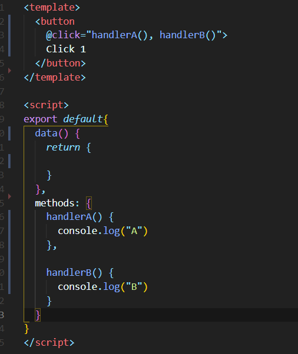
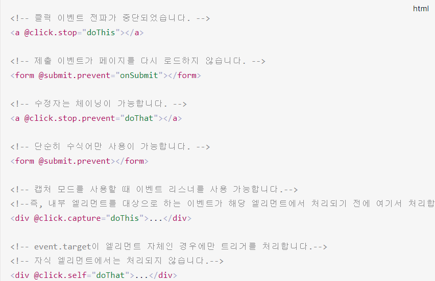

a# Vue 문법

- html 태그 안에 @click="함수명" <해당 태그 클릭시 실행>
- 태그 안에 v-if="조건식"
- v-for="fruit in fruits" :key="fruit" :name="fruit" {{ fruit }}

# Vue 라이프사이클 훅


- created
- mounted

## Vue 보간법(Interpolation)

- 문자열 : 데이터 바인딩의 가장 기본 형태는 "Mustache"(이중 중괄호 구문) 기법을 사용한 문자열 보간법(text interpolation)
- v-once 디렉티브를 사용하여 데이터가 변경되어도 갱신되지 않는 일회성 보간을 사용할 수 있다.

## v-html (원시 html)

```vue
<h1 v-html="msg"></h1>
```

- 해당 부분은 원시 html로 인식할 수 있다.

## v-bind

- html 속성에서 사용할 수 없는 부분은 바인드를 통해서 연결할 수 있다.

```vue
// 전체 문법
<h1 v-bind:id="msg"></h1>

//약어
<a :href="url"></a>

// 동적 전달인자와 함께 쓴 약어
<a :[key]="url">
```

## v-on

```vue
<a
  v-on:click="doSomething></a>

//약어
<a @click="
  doSomething
></a>

//동적 전달인자와 함께 쓴 약어
<a @[event]="doSomething"> </a>
```

## Vue computed caching

- 동일한 결과의 함수를 반복할 필요 없이 computed 된 데이터를 사용하면 됨.
- computed 값은 readonly!

## vue getter/setter

- readonly인 computed값은 Getter!
- data값은 둘의 기능 모두 가능.

```vue
computed: { reversedMessage: { get() { return
this.msg.split('').reverse().join('') }, set(value) { this.msg = value } } }
```

- 나중에 Vuex(중앙 저장 관리소)에서 사용할 수 있다.

## vue watch

- watch를 통해 데이터를 감시하고 사용할 수 있다.

```vue
watch: { msg(newValue){ console.log('msg:', newValue) } }
```

```vue
<template>
  <h1 @click="changeMessage">
    {{ msg }}
  </h1>
  <h1>{{ reversedMessage }}</h1>
</template>

<script>
export default {
  data() {
    return {
      msg: "Hello?",
    };
  },
  computed: {
    reversedMessage() {
      return this.msg.split("").reverse().join("");
    },
  },
  watch: {
    msg(value) {
      console.log("msg:", value);
    },
    reversedMessage() {
      console.log("revserdMessage:", this.reversedMessage);
    },
  },
  methods: {
    changeMessage() {
      this.msg = "Good!";
    },
  },
};
</script>
```

## vue 클래스와 스타일 바인딩

```vue
<template>
  <h1 :class="{ active: isActive }" @click="activate">
    Hello?!({{ isActive }})
  </h1>
</template>

<script>
export default {
  data() {
    return {
      isActive: false,
    };
  },
  methods: {
    activate() {
      this.isActive = true;
    },
  },
};
</script>

<style scoped>
.active {
  color: red;
  font-weight: bold;
}
</style>
```

- 바인딩 된 객체는 인라인 일 필요는 없다.
- 계산된 데이터(computed)로 내용을 관리할 수도 있다.
- 배열을 :class에 전달하여 클래스 목록을 적용 할 수 있다.
- 인라인 스타일 바인딩도 가능하다 ( Vue doc 참고 )
- 템플릿을 더 깔끔하게 만들기 위해, 스타일 객체에 직접 바인딩하는 것이 좋다.
- 2021.12.24

```vue
<!-- 예제2 -->
<template>
  <h1 :style="[fontStyle, backgroundStyle]" @click="changeStyle">Hello</h1>
</template>

<script>
export default {
  data() {
    return {
      fontStyle: {
        color: "orange",
        fontSize: "30px",
      },
      backgroundStyle: {
        backgroundColor: "black",
      },
    };
  },
  methods: {
    changeStyle() {
      (this.fontStyle.color = "red"), (this.fontStyle.fontSize = "50px");
    },
  },
};
</script>
```

## 조건부 렌더링 (21.12.25)

---

## v-if 디렉티브

- v-if, v-else

```vue
<h1 v-if="awesome">Vue is awesome!</h1>
<h1 v-else>Oh no..</h1>
```

- template 를 사용하면 div를 감싸지 않더라도 그룹으로 처리 할 수 있따.

```vue
<template>
  <button @click="handler">Click me!</button>
  <template v-if="isShow">
    <h1>Title</h1>
    <p>Paragraph 1</p>
    <p>Paragraph 2</p>
  </template>
</template>
```

- 최상의 template 태그에다는 사용 할 수 없음!

## v-show

- 구조적으로 렌더링은 해놓고 화면에 표시하지는 않는다. css로 제어한다.
- template 엘리먼트를 지원하지 않고, v-else와 함께 쓸 수 없다.
- 그래서 v-if는 게으르다.
- v-if는 전환비용이 높고, v-show는 렌더링 비용이 높다. 그러므로 무언가를 자주 전환한다면 v-show를 사용하는 것이 좋고, 런타임 시 조건이 변경되지 않는다면 v-if를 사용하는 것이 좋다.

## 반복문

---

## v-for

- id를 고유하게 만들 수 있는 module

  - shortid : install, npm i -D shortid
  - import shortid from 'shortid'
  - id : shortid.generate()

- 객체 구조 분해를 통해 쉽게 접근 할 수 있다.

```vue
<ul>
    <li
      v-for="{ id,name } in newFruits"
      :key="id">
      {{ name }} - {{ id }}
    </li>
  </ul>
```

## methods를 통해 handling 할 수 있다.

- 배열 변경을 감시하여 뷰 갱신을 트리거 한다.

```vue
<button @click="handler">
    Click me!
  </button>
<script>
import shortid from "shortid";
export default {
  data() {
    return {
      fruits: ["apple", "banana", "cherry"],
    };
  },
  computed: {
    newFruits() {
      return this.fruits.map((f) => ({ id: shortid.generate(), name: f }));
    },
  },
  methods: {
    handler() {
      this.fruits.push("Orange");
    },
  },
};
</script>
```

## 배열 교체

- 비-변이 메소드 filter(), concat(), slice()

```vue
example1.items = example1.items.filter(item => item.message.match(/Foo/))
```

- 할당 연산자를 통하여 대체하게 된다면 반응형으로 데이터를 바꿔준다.

---

(2021.12.25)

# 이벤트 핸들링

## 이벤트 청취

- v-on : @ 기호를 통해 약어를 만듬.

## 메소드 이벤트 핸들러

- v-on에 보관되는 로직이 복잡할 경우에는 v-on에 보관하는 방식은 올바르지 않다.
- script에 methods부분에 함수를 만들고 v-on으로 핸들링 해주는 것이 바람직함.

- 실행항 메소드가 여러개라면 쉼표로 구분하고 소괄호를 넣어주어야 한다.

<!--  -->


## 이벤트 수식어

- .stop
- .prevent
- .self
- .once
- .passive



- prevent를 통해서 html 기본 태그에서 동작하는 것을 막을 수 있다. == event.preventDefault()
- once 수식어를 붙이면 해당 이벤트는 한 번만 동작한다.
  - 체이닝해서 사용 할 수 있다.

## 이벤트 버블링

- 자식 태그를 클릭하면 부모 태그(상위 요소)를 클릭하는 것과 같은 효과.
- 이것을 방지하려면 event 객체를 통해 해결할 수 있다. (js - e.stopPropagation())
- vue .stop 수식어를 통해 같은 효과를 얻을 수 있다.

## 이벤트 캡쳐링

- 부모요소를 클릭하면 자녀 요소에서도 실행되는.
- capture 수식어를 달게되면 자녀요소가 클릭되면
- capture가 붙은 부모 요소를 먼저 동작 시킨다.
- 부모: A, 자녀: B 일 때 자녀클릭-> B,A / capture가 부모의 A에 붙으면
- 자녀클릭 -> A,B
- capture.stop을 하면 자녀요소 클릭시 자녀요소는 실행되지 않고 부모요소만 실행된다.

- **.self**가 붙게되면 자식요소가 아닌 노출되어있는 자신이 클릭되었을 때만 적용된다.
  - currentTarget과 Target가 같아야만 동작한다.

## wheel event

- **.passive** 수식어를 붙이면 화면 업데이트와 로직 처리를 독립적(분리)으로 할 수 있다.

## keydown event

- input type="text"에 키를 입력하면 이벤트로 키를 확인할 수 있다.
- 수식어 **.enter** 와 같이 수식어는 케밥케이스.
- 수식어에 체이닝을 사용해서 여러가지 키가 동시에 눌렸을 경우를 추적할 수 있다.

## 단방향 데이터 바인딩(연결)

- 데이터가 한 방향으로만 흐른다라는 의미(한 쪽으로만 연결)

## 양방향 데이터 바인딩

- input 요소에 @input
- @input에 함수를 입력하면 해당 함수로 event를 전달한다.
- event.target 를 통해 타겟을 알아낼 수 있따.
- @input에 인라인 요소를 적용해도 된다.

```vue
@input= "msg= $event.target.value"
```

- 이것을 다시 간소화 할 수 있다. **v-model** 디렉티브를 이용하면
- value attr와 input를 사요하지 않아도 된다.

```vue
v-model="msg"
```

## **v-model 의 주의사항**

- 한글을 입력할 때에는 한 자가 완성되기 전까지는 즉각반응 하지 않는다.
- 그래서 한글을 사용할 때에는 단방향 바인딩 :value를 사용하고
- @input을 통해서 양방향 바인딩 해주는 것이 좋다.

```vue
<template>
  <h1>
    {{ msg }}
  </h1>

  <h1>{{ checked }} </h1>

  <input
    type="text"
    :value="msg"
    @input="msg = $event.target.value" />

  <input
    type="checkbox"
    v-model="checked" />
</template>

<script>
export default {
    data() {
        return {
            msg: 'Hello world!',
            checked: false
        }
    },
    methods: {


    }
}
```

## v-model **수식어**

- **@change** 를 input 대신 이용하면 input창이 포커스 해제되면 값이 갱신된다.
- 입력이 완료

1. v-model.lazy="msg" 는 **@change**를 대신해서 사용할 수 있다!
2. msg에 123인 숫자 데이터를 넣어도 바인딩 될 때에는 문자열로 변경됨. 이것을 넘버로 받고싶으면 **v-model.number**를 입력(.number)
3. **trim()** 메소드는 js에서 앞, 뒤 공백을 없애주는 함수. **v-model.trim** 을 입력하면 동일하게 작동한다. 체이닝을 사용해 수식어를 연결할 수 있따.

# 컴포넌트 - 기초

- **props**: 부모 컴포넌트에서 자식 컴포넌트로 데이터를 보내는 부모-자식 데이터 통신.
- 여러개 할당 가능.

## 버튼 컴포넌트 (MyBtn1)

- 버튼 컴포넌트에 닫히는 태그 사이에 text를 넣고 버튼 컴포넌트 내부에 <slot></slot> 추가하면 해당 내용이 삽입됨.
- text만 들어가는 것이 아닌 다른 것 또한 모두 포함됨.

## 속성 상속

- 템플릿의 자식 요소는 **최상위 요소(루트)** 라고 한다.
- 최상위 요소가 **2개 이상**일 경우에는 자식에 물려줄 클래스가 어떤 자식의 요소에 적용 되어야 할지 지정해야 한다. (1개의 경우 상관없음)
- **inheritAttrs: false**로 바꿔주면 최상위 요소가 1개만 있어도 상속하지 않겠다는 것을 말한다.

```vue
created() { console.log(this.$attrs) }
```

- **this.$attrs**를 통해 부모에서 자식으로 물려주는 속성을 자식에서 확인할 수 있다.
- v-bind를 통해 부모로 부터 상속받은 객체를 사용할 수 있다.

## 컴포넌트 - emit ( MyBtn3 )

- event를 상속받지 않으면 사용할 수 없는 기능들을 사용하게 해준다.

1. 물려받은 컴포넌트의 script부분에 emits를 []로 생성해 사용할 이름을 입력.

```vue
//부모
<MyBtn @click="log">
//자식
<h1 @click="$emit('click')">  ABC </h1>
```

```js
export default {
  emits: ["click"],
};
```

- 꼭 click라는 이벤트가 아니여도 됨.
- 부모요소 @디렉티브 -> emits -> emit로 실행.

2. 자식 요소에서 부모요소로 데이터 전달할 때도 사용.

- 부모요소의 @디렉티브 뒤의 문자는 대시(dash)케이스 사용.

```vue
//부모
<MyBtn @click="log" @change-msg="logMsg">
    Banana
  </MyBtn>

//자식
<input type="text" v-model="msg" />
```

```js
//부모
export default {
    components: {
        MyBtn
    },
    data() {
        return {
        }
    },
    methods: {
      log(e) {
        console.log('Click')
        console.log(e)
      },
      logMsg(msg){
        console.log(msg)
      }
    },
}
//자식
export default {
    emits: [
      'click',
      'changeMsg'
    ],
    data() {
      return {
        msg: ''
    }

  },
  watch: {
      msg() {
        this.$emit('changeMsg', this.msg)
      }
    }
}
```

- emit으로 이벤트를 발생시키고 부모 요소에 연결된 디렉티브가 실행이 되고 부모요소에서 지정된 함수가 실행된다.

## Slot ( MyBtn4 )

- **<slot></slot>** 사이에 문구를 입력하면 Fallback contents (대체 컨텐츠)가 나타난다.

- **이름을 갖는 슬롯(순서 보장)** v-slot(약어 #) - slot name
  - ```vue
    //부모
    <MyBtn>
      <template #icon>
        <span>(B)</span>
      </template>
      <template #text>
        <span>Banana</span>
      </template>
    </MyBtn>
    //자식
    <div class="btn">
        <slot name="icon"></slot>
        <slot name="text"></slot>
      </div>
    ```

## 컴포넌트 - Provide, Inject ( Parent, Child. vue)

- 부모요소에서 자식, 자식에 자식으로 주기 위해서 props를 중복해서 사용하여야 하는 문제를 해결한다.
- 부모요소에 provide를 만들어 msg를 return 한다.

```vue
//상위 부모요소. provide() { return { msg: this.message } } // 자식요소 inject:
['msg']
```

- **주의사항**

  - provide를 사용할 때에는 반응성을 제공할 수가 없다.
  - 1회성으로 사용하거나 반응성으로 사용하려면 추가적인 작업이 필요하다.
  - 추가작업으로 import { computed } from 'vue' 를 통해 provide의 msg부분에 computed를 추가하여야 한다.
  - 그리고 자식요소에서는 **msg.value**로 접근하여야 한다.

- 부모 -> 자식 : props, 조상 -> 손자 : provide + inject | computed

## Refs

- ref는 class나 id처럼 참조 할 때 사용(vue 전용)
- <h1 ref="hello"></h1> 처럼 사용
- **this.$refs.hello** < 접근법
- **주의**
  - 연결된 직후에만 사용할 수 있음.
  - created() -> X
  - mounted() -> O
- 부모요소에서 자식을 참고할 때는 **this.$refs.hello.$el**로 참조 가능.
- 자식요소에 요소가 여러개일 경우 원하는 요소에 refs로 다시 이름 지정 후에 **this.$refs.hello.$refs.~**으로 접근
